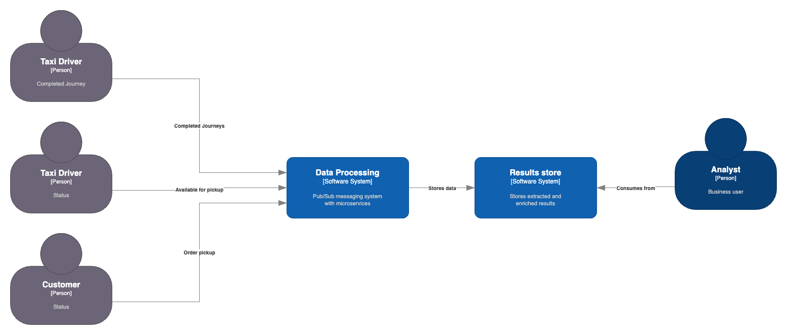
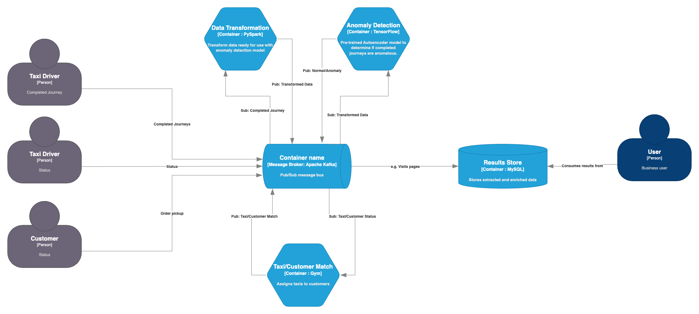

# NYC Taxi Platform
This project replicates a taxi ordering service using the NYC taxi dataset. Customer orders 
are assigned to drivers that is trained to balance equal utilisation against reduced pickup times.   
Completed journeys are checked using an anomaly detector and published to relevant Kafka topics for 
downstream monitoring.

There are 3 main directories:
- Anomaly Development: Autoencoder model training and evaluation
- Assignment Development: PPO model training and evaluation
- Model Deployment: Fully functional system

For a detailed description please refer to the ReadMe documents within each directory.

## HLD

C4 modelling is used to describe and define architectures in an abstract and simple way. 
It is a different way to approach modelling which focuses on four C’s: 

- Context
- Containers
- Components
- Code

The simplest view is referred to as a **Context** diagram. This shows how users interact with the 
system and how software fits together.

In this system we have two main actors, the Taxi Driver and the Customer with the Taxi Driver executing two 
main actions.

The **Container** diagram drills down to the next level of the system and details technology choices. 
We have used Kafka as the messaging queue, PySpark for data processing and MariaDB to store results. 

