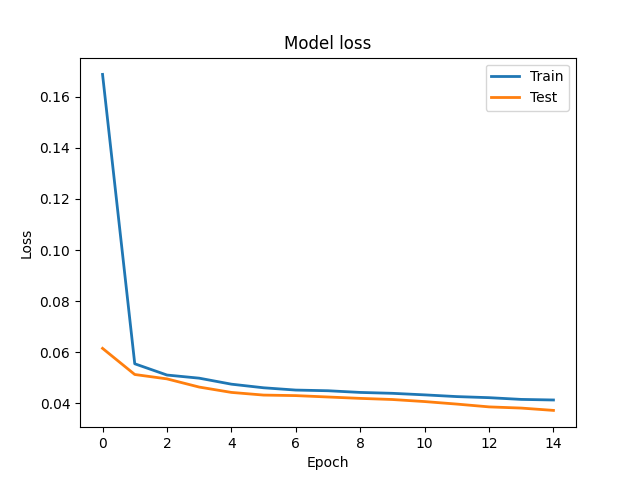
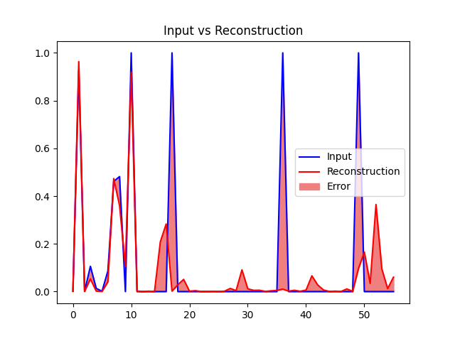
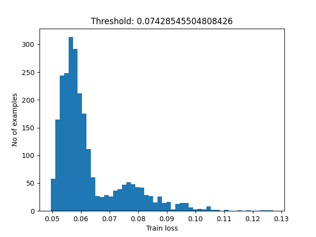

# NYC Taxi Anomaly Detection
This project uses PySpark to process the NYC taxi dataset and then trains an autoencoder using TensorFlow 
to detect anomalous journeys based on reconstruction error. EDA is done using the Koalas library and is used 
to inform data quality decisions taken during processing. 

Directory contents:
- Data processing: Exploratory data analysis and processing of NYC dataset using Spark
- Graphs: Model training and evaluation images
- Scripts: Autoencoder model training and evaluation
- Spark-cluster: Spark dockerfile and start up script

The docker compose will create the following containers:

| container    | Exposed ports |
|--------------|---------------|
| spark-master | 9090          |

## Installation
The following steps will set up the network and generate example data:

### Pre-requisites
- Docker
- Docker-compose

### Docker compose
To run the network in detached mode use the ```-d``` flag at the end of the command:  
```shell
docker-compose up
```

### Jupyter Notebooks
Jupyter Notebooks has been pre-installed on the master node. 
To start a notebook session, connect to the docker container and start a pyspark session.

```shell
docker exec -it <docker container name> bash
pyspark
```
The notebook URL will be displayed within the terminal and can be accessed via your 
local browser using the ```0.0.0.0``` ip address. 

### Data download
Data can be downloaded using the scripts found in [scripts](scripts/data_download) directory. These are the 
same as those detailed in this [repo](https://github.com/toddwschneider/nyc-taxi-data)

### Data Processing
```shell
spark-submit --master spark://spark-master:7077 --driver-memory 3G --executor-memory 3G /scripts/data_transformation.py
```

## Anomaly Detection

A simple Autoencoder is used to detect anomalous taxi journeys. The architecture and training 
files can be found in the [script](scripts) directory. The training process has been set up 
to simulate working in a big data environment so parquet files are streamed to the model during 
training as a tensorflow generator. 

The training loss for a model trained on the 2019 data is below:



A comparison of the input and reconstructed signal:



Setting the error threshold as mean +1 standard deviation:

